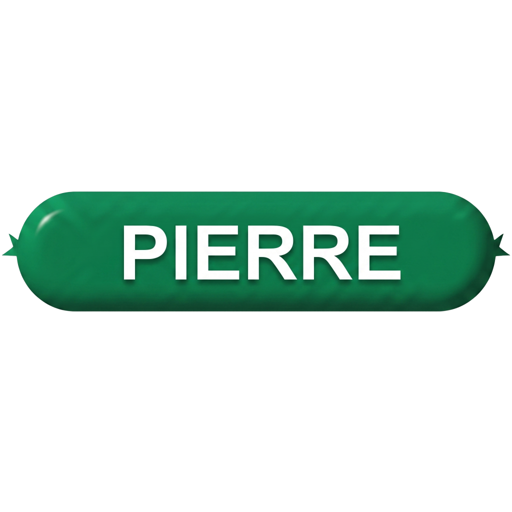

<div align="center">
  
  <h1>Pierre Client</h1>
  <p><strong>Open-source custom Minecraft 1.21.11 client and launcher.</strong></p>

  [](https://opensource.org/licenses/MIT)
  [](#)
  [](#)
</div>

<br/>

## Features

Pierre Client is an open-source launcher built with C# and .NET Core.

* **Minecraft 1.21.11 Support:** Built specifically for custom 1.21.11 instances.
* **Auto-Installer:** Automatically downloads required Fabric libraries and mods.
* **Java Management:** Uses CmlLib to locate or download the correct Java 21 runtime automatically.
* **Native Discord RPC:** Built-in Discord Rich Presence integration directly from the launcher.
* **Command-Line Limit Bypass:** Uses Java `@argfile` to bypass the Windows 8191 character limit.
* **WPF Interface:** Clean and lightweight WPF-based user interface.

## Download & Install

1. Download the latest source from the repository.
2. Ensure you have the [.NET 10.0 SDK](https://dotnet.microsoft.com/download) installed.
3. Build the project and run the output executable.

## How to Compile

To compile the launcher from source, open a terminal in the project directory and run:

```bash
cd PierreLauncher
dotnet build -c Release
```

The compiled executable will be located in `PierreLauncher/bin/Release/net10.0-windows/`.
Alternatively, you can run `Start.bat` from the root directory for quick testing.

## Architecture

- **Framework:** .NET 10.0 (WPF)
- **Core Library:** CmlLib.Core 
- **RPC:** DiscordRichPresence 

## License

This project is entirely open-source and available under the MIT License. Contributions are welcome.
